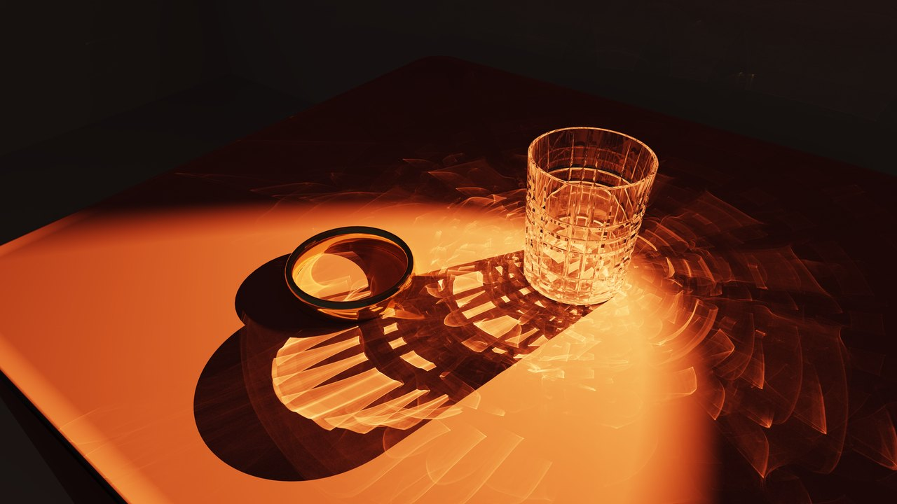
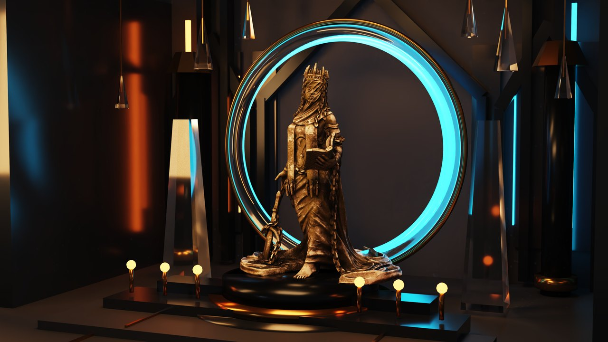
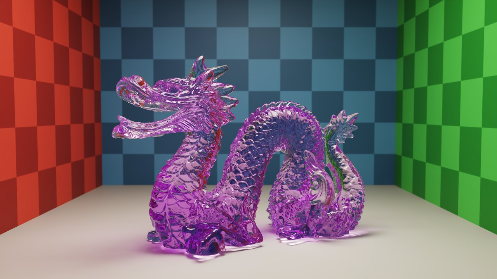
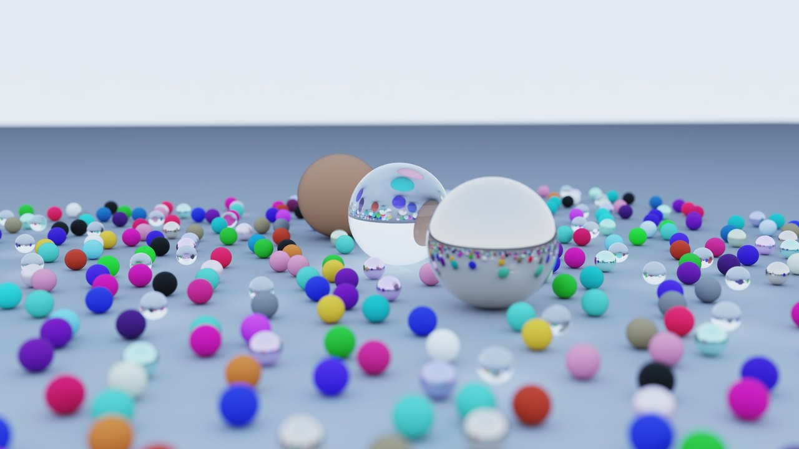

# Path tracer GPU en CUDA / OptiX

Moteur de rendu physiquement réaliste, entièrement sur GPU. Les scènes sont créées dans Blender et exportées en glTF 2.0 ; l'application les charge, les affiche et les rend.

[](img/github/caustic_lab_4k.jpg)
[](img/github/gothic_reliquary_4k.jpg)
[](img/github/dragon_cornell_4k.jpg)
[](img/github/sphere_field_4k.jpg)

## Techniques

- **Rendu**
  - path tracing progressif sur OptiX 9, accumulation temporelle ;
  - roulette russe ;
  - tampon d'affichage partagé avec OpenGL.
- **Matériaux**
  - metallic-roughness glTF ;
  - microfacettes GGX échantillonnées sur les normales visibles, Fresnel de Schlick, masquage de Smith ;
  - textures de couleur, rugosité, normales, émission ;
  - transmission, réflexion totale interne, indice de réfraction, dispersion ;
  - absorption volumique de Beer-Lambert.
- **Éclairage**
  - lumières ponctuelles, géométrie émissive, environnements HDRI ;
  - échantillonnage par importance des sources et de l'environnement ;
  - échantillonnage par importance multiple, heuristique de puissance ;
  - caustiques par photon mapping, grille de hachage GPU, estimation de densité.
- **Image**
  - débruitage OptiX guidé par albédo et normales, sur couches diffuse, réflexion et réfraction ;
  - profondeur de champ ;
  - tone mapping ACES ;
  - export PNG et EXR.

## Dépendances

CMake 3.24+, un compilateur C++20, le CUDA Toolkit 12+, un GPU NVIDIA Turing ou plus récent avec un pilote R570+, ainsi que les paquets de développement GLFW 3.4, OpenGL, libpng et zlib. fastgltf `v0.9.0`, OptiX `v9.0.0`, TinyEXR `v1.0.13` et stb sont récupérés automatiquement à la configuration, à des révisions figées : une connexion réseau est nécessaire au premier `cmake`.

## Usage

```sh
cmake -S . -B build -DCMAKE_BUILD_TYPE=Release
cmake --build build -j
./build/bin/raytracer scene.glb
```

La fenêtre accumule un échantillon par pixel et par image. Clic droit maintenu pour regarder autour, `WASD` ou `ZQSD` plus `E` et `C` pour se déplacer, molette pour la vitesse, `Shift` pour accélérer, `F` pour un rendu final à 256 échantillons avec débruitage et export dans `renders/`, `Échap` pour quitter.

En mode hors ligne, le profil `final` active le photon mapping et une profondeur de 32 rebonds ; `preview` s'arrête à 5.

```sh
./build/bin/raytracer scene.glb --output render.png
./build/bin/raytracer scene.glb --profile final --samples 1024 --output render.exr
./build/bin/raytracer scene.glb --profile final --width 3840 --height 2160 --denoise off --output brut.png
```

Le PNG est débruité et tone mappé, l'EXR conserve les valeurs HDR en linéaire scène.

Les scènes vitrines ne sont pas versionnées ici : leurs exports GLB et sources Blender pèsent plusieurs centaines de mégaoctets. N'importe quel fichier glTF 2.0 fonctionne. L'extension Blender de `tools/blender/raytracer_tools` expose dans la barre latérale de la vue 3D les réglages propres au moteur (HDRI, exposition, ouverture, distance de mise au point), vise la caméra active sur l'objet sélectionné et exporte la scène en GLB.

## Licence

MIT. Voir [`LICENSE`](LICENSE).
